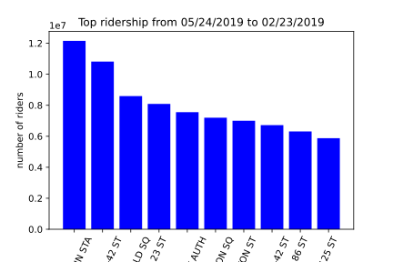

# MTA data analysis

MTA dataset is new york subway station turnstile data. 

 

This project at Metis was initially designed to analyze the MTA data to figure out an optimal agent placement to send out flyers for an upcoming gala in early summer. Considering the unfortunate COVID-19 pandemic, especially New York as the current epicenter of this outbreak, there's possibly no gala will be held. It will be a little strange to still recommend agent placement for subway stations.

However, we can still take a look at the dataset and see how this pandemic affect people's lives from subway station perspective.

 
Anyway, Let's take a look at the dataset first:

<em>C/A</em> means control area. There're maybe several control areas in a large station, each controlling several turstiles.

<em>SCP</em> means subunit channel position. Basically referring to individual turstile.

Here's the top 10 ridership stations from last spring

